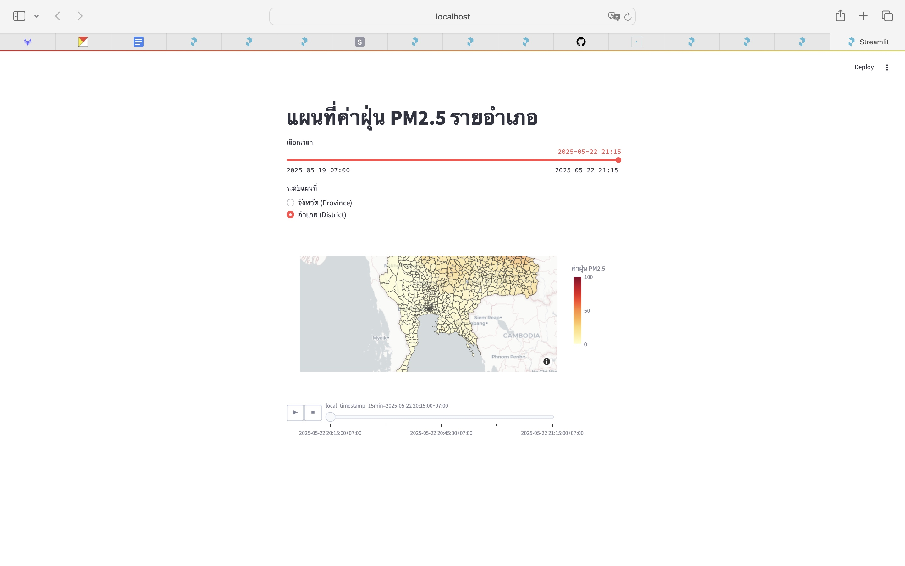

# Real-Time PM 2.5 Monitoring Dashboard

#### 6524651434 สิริปรียา เจริญจิตร

โปรเจกต์นี้มีเป้าหมายเพื่อพัฒนาแดชบอร์ดสำหรับตรวจสอบและแสดงข้อมูลค่าฝุ่น PM 2.5 แบบเรียลไทม์ โดยอาศัยการทำงานร่วมกันของ Jupyter Notebook และ Docker Compose เพื่อให้การพัฒนาและการนำระบบไปใช้งานจริงเป็นไปอย่างสะดวกและมีประสิทธิภาพ

## 1. ความเป็นมา (Background)

ในยุคปัจจุบันที่ขับเคลื่อนด้วยข้อมูล ความสามารถในการรวบรวม ประมวลผล และแสดงผลข้อมูลแบบเรียลไทม์ ถือเป็นปัจจัยสำคัญที่ช่วยสนับสนุนการตัดสินใจในหลากหลายอุตสาหกรรม ตั้งแต่การเกษตรไปจนถึงการวางผังเมือง โดยเฉพาะในบริบทของคุณภาพอากาศ การมีระบบที่สามารถตรวจวัดค่าฝุ่นละอองในอากาศแบบเรียลไทม์ได้อย่างแม่นยำ จะช่วยให้ภาครัฐ ภาคเอกชน และประชาชนสามารถรับมือกับปัญหาฝุ่นละอองขนาดเล็ก (PM2.5) ได้อย่างมีประสิทธิภาพและทันท่วงที

การพัฒนา Data Pipeline ซึ่งเป็นกระบวนการที่จัดการการไหลของข้อมูลตั้งแต่การดึงข้อมูลจากแหล่งต้นทาง ไปจนถึงการจัดเก็บและการแสดงผลแบบอัตโนมัติ เป็นหัวใจสำคัญของการบริหารจัดการข้อมูลแบบเรียลไทม์ อย่างไรก็ตาม การออกแบบระบบ pipeline ดังกล่าวมักมีความซับซ้อน เนื่องจากต้องอาศัยความรู้ด้านการจัดการ workflow การใช้ containerization และเครื่องมือสำหรับการแสดงผลข้อมูล

โครงงานนี้มีเป้าหมายเพื่อขยายแนวคิดเชิงทฤษฎีไปสู่การประยุกต์ใช้งานจริง โดยมุ่งเน้นการพัฒนา pipeline ที่สามารถดึงข้อมูลค่าฝุ่น PM2.5 จาก API (เช่น OpenWeatherMap) ในทุก ๆ 15 นาที จากนั้นทำการจัดเก็บข้อมูลในฐานข้อมูลที่มีน้ำหนักเบา (lightweight) เช่น PostgreSQL และแสดงผลผ่านแดชบอร์ดแบบ interactive เพื่อให้ผู้ใช้งานสามารถติดตามสถานการณ์คุณภาพอากาศได้แบบเรียลไทม์

นอกจากนี้ โครงงานยังมุ่งสำรวจความเป็นไปได้ในการประยุกต์ใช้ Machine Learning (ML) เพื่อคาดการณ์แนวโน้มค่าฝุ่นในอนาคต ซึ่งจะช่วยยกระดับระบบจากการรายงานสถานการณ์สู่การวิเคราะห์เชิงคาดการณ์ (Predictive Analytics) ที่มีคุณค่าในเชิงการวางแผนและการตัดสินใจ

โครงการนี้มีระยะเวลาดำเนินการทั้งหมด 3 สัปดาห์ ครอบคลุมการออกแบบ พัฒนา และจัดแสดงผลระบบแดชบอร์ดสำหรับการติดตามค่าฝุ่น PM2.5 แบบเรียลไทม์ โดยใช้เครื่องมือสำคัญ ได้แก่ Prefect, Docker, PostgreSQL, และเครื่องมือสำหรับสร้างแดชบอร์ด เช่น Streamlit หรือ Looker Studio โดยมีจุดมุ่งหมายให้สามารถนำไปต่อยอดใช้งานได้จริง ทั้งในบริบทของการวิจัย การเฝ้าระวังคุณภาพอากาศในชุมชน หรือการสนับสนุนการวางแผนในระดับท้องถิ่น

## 2. วัตถุประสงค์ (Objective)

วัตถุประสงค์หลักของโครงงาน **Real-Time PM2.5 Monitoring Dashboard** คือการพัฒนาระบบ data pipeline ที่สามารถเก็บรวบรวม ประมวลผล จัดเก็บ และแสดงผลข้อมูลค่าฝุ่นละอองขนาดเล็ก PM2.5 แบบเรียลไทม์ทุก ๆ 15 นาที โดยมีเป้าหมายในการแสดงกระบวนการทำงานของระบบด้าน วิศวกรรมข้อมูล (Data Engineering) ที่ทันสมัย ซึ่งจะประกอบด้วยวัตถุประสงค์ย่อยดังนี้:

* **การเก็บข้อมูล (Data Collection):** พัฒนา pipeline โดยใช้ Prefect 3 ในการดึงข้อมูลค่าฝุ่น PM2.5 และข้อมูลสภาพอากาศอื่น ๆ เช่น อุณหภูมิ ความชื้น และความเร็วลมจาก OpenWeatherMap API ทุก ๆ 15 นาที สำหรับพื้นที่กรุงเทพมหานครหรือตำบลอื่นในประเทศไทย
* **การประมวลผลและจัดเก็บข้อมูล (Data Processing and Storage):** ดำเนินการแปลงข้อมูลดิบจาก API เช่น การจัดการค่าที่เป็น null การแปลงหน่วย และการจัดรูปแบบข้อมูลให้อยู่ในโครงสร้างที่เหมาะสม พร้อมทั้งจัดเก็บข้อมูลในฐานข้อมูลที่รองรับการเข้าถึงข้อมูลได้รวดเร็ว เช่น Parquet ใน data lake ที่มี schema ที่กำหนดไว้อย่างชัดเจน
* **การแสดงผลข้อมูล (Visualization):** สร้างแดชบอร์ดแบบ interactive ด้วย Streamlit หรือ Looker Studio เพื่อแสดงผลค่าฝุ่น PM2.5 แบบเรียลไทม์และแนวโน้มย้อนหลัง ซึ่งจะช่วยให้ประชาชนทั่วไปที่ไม่มีพื้นฐานทางเทคนิคสามารถเข้าถึงข้อมูลได้อย่างง่ายดาย
* **การจัดการและการนำไปใช้งานจริง (Orchestration and Deployment):** นำระบบ pipeline ขึ้นใช้งานในสภาพแวดล้อมแบบ container โดยใช้ Docker และ Prefect เพื่อให้ระบบสามารถทำงานได้อย่างเสถียร และรองรับการขยายขนาดในอนาคต
* **การวิเคราะห์เชิงคาดการณ์ (Predictive Analysis):** ใช้เทคนิค Machine Learning เบื้องต้น เช่น regression เพื่อพยากรณ์แนวโน้มค่าฝุ่น PM2.5 และวิเคราะห์หาปัจจัยที่มีผลต่อการเพิ่มขึ้นของค่าฝุ่น PM2.5 จากข้อมูลที่เก็บมา ซึ่งจะแสดงศักยภาพของระบบในการวิเคราะห์เชิงลึกและการคาดการณ์ในอนาคต

## 3. ประโยชน์ (Benefits)

โครงการ Real-Time PM2.5 Monitoring Dashboard มีประโยชน์หลายประการสำหรับผู้มีส่วนได้ส่วนเสีย รวมถึงสถาบันการศึกษา นักเรียน และองค์กรที่สนใจด้านวิศวกรรมข้อมูล โดยประโยชน์เหล่านี้สอดคล้องกับเป้าหมายทางการศึกษาของโครงการ papapipeline และความต้องการในการประยุกต์ใช้จริงในโลกปัจจุบัน

**ประโยชน์ทางการศึกษา**

* **การเรียนรู้จากประสบการณ์จริง:** โครงการนี้เป็นตัวอย่างที่ดีในการพัฒนาระบบ data pipeline โดยครอบคลุมทั้งการดึงข้อมูล การประมวลผล การจัดเก็บ การจัดการการทำงาน (orchestration) และการแสดงผล ซึ่งเหมาะสมสำหรับการเรียนการสอนในหลักสูตรด้านวิทยาการข้อมูลและวิศวกรรม

* **เครื่องมือที่ทันสมัย:** นักเรียนจะได้เรียนรู้การใช้งานเครื่องมือมาตรฐานในอุตสาหกรรม เช่น Prefect 3, Docker, และ Streamlit ซึ่งจะช่วยเตรียมความพร้อมให้กับการทำงานในสายอาชีพวิศวกรรมข้อมูล

* **การประยุกต์ใช้ในโลกจริง:** โครงการนี้ช่วยให้นักเรียนเห็นว่าแนวคิดทางทฤษฎี เช่น การจัดการ workflow สามารถนำมาประยุกต์ใช้กับปัญหาจริงได้อย่างไร ทำให้การเรียนมีความน่าสนใจมากยิ่งขึ้น

* **การมีส่วนร่วมในโอเพนซอร์ส:** โครงการนี้สามารถแบ่งปัน GitHub repository และเอกสารต่าง ๆ กับชุมชน ซึ่งช่วยเพิ่มคุณค่าให้กับแหล่งข้อมูลเช่น papapipeline

**ประโยชน์ทางปฏิบัติ**

* **การติดตามข้อมูลแบบเรียลไทม์:** โครงการนี้ช่วยให้ผู้มีส่วนได้ส่วนเสียท้องถิ่น เช่น เกษตรกร หรือผู้วางแผนจัดกิจกรรม สามารถติดตามสภาพอากาศได้ในเวลาใกล้เคียงกับเรียลไทม์ ซึ่งช่วยในการตัดสินใจที่รวดเร็วและแม่นยำ

* **ความสามารถในการขยายระบบ:** การออกแบบ pipeline แบบโมดูลาร์ทำให้สามารถขยายไปยังหลาย ๆ เมือง หรือเพิ่มแหล่งข้อมูลเพิ่มเติม หรือแม้แต่การใช้งานบนคลาวด์ได้ ซึ่งทำให้สามารถประยุกต์ใช้ในระบบที่ใหญ่ขึ้นได้

* **การแสดงผลข้อมูลที่ใช้งานง่าย:** แดชบอร์ดที่สร้างขึ้นด้วย Streamlit มีอินเทอร์เฟซที่ใช้งานง่าย ทำให้ผู้ใช้งานที่ไม่มีพื้นฐานด้านเทคนิคสามารถเข้าใจข้อมูลและแนวโน้มต่าง ๆ ได้อย่างสะดวก

* **ศักยภาพในการทำนาย:** โมเดล Machine Learning (ML) ที่เป็นออปชันในโครงการนี้สามารถใช้ในการวิเคราะห์และทำนายแนวโน้มของสภาพอากาศ เช่น การพยากรณ์อุณหภูมิ หรือแนวโน้มสภาพอากาศในอนาคต ซึ่งสามารถนำไปใช้ประโยชน์ในหลายอุตสาหกรรม เช่น เกษตรกรรม หรือ พลังงาน

**ประโยชน์สำหรับองค์กร**

* **ต้นทุนต่ำ:** โครงการนี้สร้างขึ้นโดยใช้เครื่องมือที่ไม่เสียค่าใช้จ่าย (เช่น OpenWeatherMap API, Parquet, Streamlit) ช่วยลดต้นทุนในการพัฒนาและดำเนินการระบบ ในขณะที่ยังคงให้ผลลัพธ์ที่มีประสิทธิภาพ

* **เป็นรากฐานสำหรับการเติบโต:** โครงการนี้เป็นต้นแบบสำหรับองค์กรที่ต้องการนำระบบ data pipeline มาใช้ในการติดตามข้อมูลแบบเรียลไทม์ และสามารถพัฒนาต่อไปเป็นระบบที่มีขนาดใหญ่ขึ้นได้

* **การมีส่วนร่วมในชุมชน:** โครงการนี้สนับสนุนความรู้และการพัฒนาซอฟต์แวร์โอเพนซอร์ส ซึ่งส่งเสริมการศึกษาและการพัฒนาทักษะการใช้ข้อมูล โดยเฉพาะในบริบทของประเทศไทยหรือในชุมชนท้องถิ่นที่มีความต้องการในการพัฒนาความสามารถด้านข้อมูล

## 4. ตัวชี้วัดความสำเร็จ (Key Performance Indicators) 
เพื่อประเมินความสำเร็จของโครงการอย่างครอบคลุมภายในระยะเวลา 3 สัปดาห์ โครงการนี้ได้กำหนดตัวชี้วัดที่ครอบคลุมทั้งด้านเทคนิค ผลสัมฤทธิ์ทางการเรียนรู้ และประโยชน์เชิงปฏิบัติ ดังนี้

**ตัวชี้วัดด้านเทคนิค (Technical KPIs)**
* **ความเสถียรของ Pipeline (Pipeline Reliability)**

&nbsp;&nbsp;&nbsp;&nbsp;&nbsp;&nbsp;&nbsp;&nbsp;เป้าหมาย: Pipeline ควรทำงานสำเร็จอย่างน้อย 95% ของจำนวนรอบทั้งหมดใน 24 ชั่วโมง (~96 ครั้ง) โดยมีความล้มเหลวจาก API หรือเครือข่ายไม่เกิน 5%

&nbsp;&nbsp;&nbsp;&nbsp;&nbsp;&nbsp;&nbsp;&nbsp;วิธีวัดผล: ตรวจสอบสถานะของแต่ละรอบการทำงานผ่าน Prefect UI (เช่น success, failure, retry)

* **ปริมาณข้อมูลที่จัดเก็บได้**

&nbsp;&nbsp;&nbsp;&nbsp;&nbsp;&nbsp;&nbsp;&nbsp;เป้าหมาย: เก็บข้อมูลสภาพอากาศอย่างน้อย 1,000 รายการในรูปแบบ Apache Parquet

&nbsp;&nbsp;&nbsp;&nbsp;&nbsp;&nbsp;&nbsp;&nbsp;วิธีวัดผล: Query เพื่อนับจำนวน record ที่จัดเก็บในไฟล์ Parquet

* **ประสิทธิภาพของแดชบอร์ด**

&nbsp;&nbsp;&nbsp;&nbsp;&nbsp;&nbsp;&nbsp;&nbsp;เป้าหมาย: แดชบอร์ด Streamlit ควรอัปเดตข้อมูลทุก 15 นาที โดยให้บริการได้รวดเร็ว (อย่างน้อย 90% ของผู้ใช้งานได้รับข้อมูลภายใน 3 วินาที)

&nbsp;&nbsp;&nbsp;&nbsp;&nbsp;&nbsp;&nbsp;&nbsp;วิธีวัดผล: ทดสอบความเร็วการโหลดข้อมูลของแดชบอร์ดแบบ manual

* **ความเสถียรของการนำระบบขึ้นใช้งาน**

&nbsp;&nbsp;&nbsp;&nbsp;&nbsp;&nbsp;&nbsp;&nbsp;เป้าหมาย: Docker containers (Jupyter, Prefect, Streamlit) ทำงานต่อเนื่องโดยไม่มี downtime เป็นเวลาอย่างน้อย 24 ชั่วโมง

&nbsp;&nbsp;&nbsp;&nbsp;&nbsp;&nbsp;&nbsp;&nbsp;วิธีวัดผล: ตรวจสอบ log และสถานะ container ผ่าน Docker

**ตัวชี้วัดด้านการเรียนรู้ (Educational KPIs)**
* **คุณภาพของเอกสารประกอบโครงการ**

&nbsp;&nbsp;&nbsp;&nbsp;&nbsp;&nbsp;&nbsp;&nbsp;เป้าหมาย: README บน GitHub และรายงานฉบับสมบูรณ์ต้องมีเนื้อหาชัดเจน แบ่งเป็นส่วน setup, การใช้งาน และผลลัพธ์ และได้รับคะแนนเฉลี่ยไม่น้อยกว่า 4/5 จากเพื่อนหรือนักวิชาการ

&nbsp;&nbsp;&nbsp;&nbsp;&nbsp;&nbsp;&nbsp;&nbsp;วิธีวัดผล: ขอรับความคิดเห็นจากผู้รีวิว 3–5 คน

* **ผลสัมฤทธิ์ทางการเรียนรู้**

&nbsp;&nbsp;&nbsp;&nbsp;&nbsp;&nbsp;&nbsp;&nbsp;เป้าหมาย: นักศึกษาใหม่หรือผู้เรียนระดับต้นควรสามารถตั้งค่าและรัน pipeline ได้สำเร็จภายใน 2 ชั่วโมง ในสัดส่วนไม่น้อยกว่า 80%

&nbsp;&nbsp;&nbsp;&nbsp;&nbsp;&nbsp;&nbsp;&nbsp;วิธีวัดผล: ทดสอบกับนักศึกษา 5–10 คน และบันทึกเวลาและผลลัพธ์

* **การมีส่วนร่วมในชุมชน**

&nbsp;&nbsp;&nbsp;&nbsp;&nbsp;&nbsp;&nbsp;&nbsp;เป้าหมาย: ได้รับดาว (star) บน GitHub อย่างน้อย 10 ดวง หรือมียอดเข้าชม repository อย่างน้อย 50 ครั้ง ภายในวันที่ 31 พฤษภาคม 2025

&nbsp;&nbsp;&nbsp;&nbsp;&nbsp;&nbsp;&nbsp;&nbsp;วิธีวัดผล: ตรวจสอบสถิติบน GitHub

**ตัวชี้วัดด้านประโยชน์ใช้งานจริง (Practical KPIs)**
* **ประโยชน์ของการแสดงผลข้อมูล**

&nbsp;&nbsp;&nbsp;&nbsp;&nbsp;&nbsp;&nbsp;&nbsp;เป้าหมาย: แดชบอร์ดต้องแสดงอย่างน้อย 3 ตัวชี้วัด เช่น อุณหภูมิ ความชื้น ความเร็วลม พร้อมแผนภูมิแบบ interactive อย่างน้อย 1 แบบ (เช่น แนวโน้มอุณหภูมิ)

&nbsp;&nbsp;&nbsp;&nbsp;&nbsp;&nbsp;&nbsp;&nbsp;วิธีวัดผล: ตรวจสอบคุณสมบัติของแดชบอร์ดในช่วงการทดสอบ

* **ประสิทธิภาพของโมเดล ML**

&nbsp;&nbsp;&nbsp;&nbsp;&nbsp;&nbsp;&nbsp;&nbsp;เป้าหมาย: โมเดล Linear Regression ควรทำได้ค่า R² อย่างน้อย 0.5 ในการพยากรณ์อุณหภูมิจากข้อมูล 3 สัปดาห์

&nbsp;&nbsp;&nbsp;&nbsp;&nbsp;&nbsp;&nbsp;&nbsp;วิธีวัดผล: คำนวณค่า R² ด้วย scikit-learn

* **ความพึงพอใจของผู้มีส่วนได้ส่วนเสีย**

&nbsp;&nbsp;&nbsp;&nbsp;&nbsp;&nbsp;&nbsp;&nbsp;เป้าหมาย: ผู้มีส่วนเกี่ยวข้อง (เช่น อาจารย์ นักวิจัย หรือผู้ใช้งานในพื้นที่) อย่างน้อย 3–5 คน ให้คะแนนความพึงพอใจเกี่ยวกับการใช้งานและข้อมูลจากแดชบอร์ดไม่ต่ำกว่า 4/5

&nbsp;&nbsp;&nbsp;&nbsp;&nbsp;&nbsp;&nbsp;&nbsp;วิธีวัดผล: แบบสอบถามหรือสัมภาษณ์ผู้ใช้งาน

## 5. ภาพรวมแผนดำเนินงานของโครงการ (Project Plan Overview)
ระยะเวลาโครงการ: 3 สัปดาห์ (ประมาณ 10–15 ชั่วโมงต่อสัปดาห์)

**แผนการดำเนินงาน (Timeline)**
* **สัปดาห์ที่ 1 (28 เมษายน – 4 พฤษภาคม):**
ออกแบบโครงสร้างพื้นฐานและสถาปัตยกรรมของระบบข้อมูล รวมถึงตั้งค่า GitHub และ Docker

&nbsp;&nbsp;&nbsp;&nbsp;&nbsp;&nbsp;&nbsp;&nbsp;สิ่งที่จะส่งมอบ: แผนภาพโครงสร้างระบบ (Infrastructure Diagram), โครงสร้างข้อมูล Parquet (Schema), ไฟล์ docker-compose.yml

* **สัปดาห์ที่ 2 (5 – 11 พฤษภาคม):**
พัฒนา Prefect flows สำหรับการเก็บและประมวลผลข้อมูล, จัดทำไฟล์ Parquet และพัฒนาแดชบอร์ดด้วย Streamlit

&nbsp;&nbsp;&nbsp;&nbsp;&nbsp;&nbsp;&nbsp;&nbsp;สิ่งที่จะส่งมอบ: ระบบ pipeline ที่สามารถทำงานได้จริง, แดชบอร์ดสำหรับแสดงผลข้อมูล, การบันทึกความคืบหน้าใน GitHub

* **สัปดาห์ที่ 3 (12 – 18 พฤษภาคม):**
นำ pipeline ไปใช้งานจริง ทดสอบการทำงานอย่างต่อเนื่องมากกว่า 24 ชั่วโมง ปรับปรุงแดชบอร์ด และจัดทำเอกสารสรุปโครงการ

&nbsp;&nbsp;&nbsp;&nbsp;&nbsp;&nbsp;&nbsp;&nbsp;สิ่งที่จะส่งมอบ: pipeline ที่พร้อมใช้งาน, แดชบอร์ดที่ผ่านการทดสอบแล้ว, รายงานสรุปผลการดำเนินงาน

**ทรัพยากรที่ใช้ (Resources)**
* **เครื่องมือ (Tools):** Prefect 3, Docker, Parquet, OpenWeatherMap API (เวอร์ชันฟรี), Streamlit, Python

* **ฮาร์ดแวร์ (Hardware):** เครื่องคอมพิวเตอร์ส่วนตัวหรือเซิร์ฟเวอร์คลาวด์ (แนะนำ RAM 4GB, CPU 2 คอร์, พื้นที่เก็บข้อมูล 20GB)

* **งบประมาณ (Budget):** ใช้เครื่องมือฟรีเป็นหลัก (หากขยายระบบอาจมีค่าใช้จ่ายเพิ่มเติมจากบริการคลาวด์)

## 6. สรุป (Conclusion)

